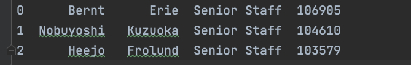

- This program will let you store data in a temporary container
- It will let you visualize that data using Matplotlib
- You have a csv file named Company_data
- Here's a small view of the file:

- The data is  sorted based on the salary in desc order